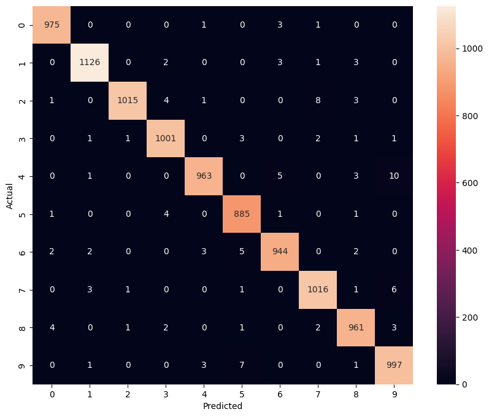

Dense_NN_vs_CNN_on_MNIST-


Handwritten Digit Recognition — Dense NN vs CNN on MNIST

This project explores how different neural network architectures perform on the MNIST handwritten digit dataset.

We first build a simple Dense Neural Network, evaluate its weaknesses, and then improve performance using a Convolutional Neural Network (CNN).

---
Dataset

MNIST: 60,000 training and 10,000 testing images of handwritten digits (28x28 grayscale).

---
Model 1 — Dense Neural Network

Architecture:
- Flatten (784)
- Dense (128, ReLU)
- Dense (10, Softmax)

Results

- Test Accuracy: ~97%
- Common Confusions: 5 vs 3, 9 vs 4


Observations

The model struggles when digits are spatially shifted or written messily because flattening destroys spatial information.
precision    recall  f1-score   support

           0       0.99      0.99      0.99       980
           1       0.99      0.99      0.99      1135
           2       0.98      0.98      0.98      1032
           3       0.96      0.98      0.97      1010
           4       0.98      0.97      0.98       982
           5       0.99      0.96      0.97       892
           6       0.98      0.98      0.98       958
           7       0.98      0.97      0.97      1028
           8       0.96      0.98      0.97       974
           9       0.96      0.97      0.97      1009

    accuracy                           0.98     10000
   macro avg       0.98      0.98      0.98     10000
weighted avg       0.98      0.98      0.98     10000

---

Model 2 — Convolutional Neural Network (CNN)

Architecture:
- Conv2D → MaxPool
- Conv2D → MaxPool
- Dense → Output

Results

- Test Accuracy: ~99%



Observations

CNN preserves spatial structure and learns edge/shape detectors, leading to better generalization.
precision    recall  f1-score   support

           0       0.99      0.99      0.99       980
           1       0.99      0.99      0.99      1135
           2       1.00      0.98      0.99      1032
           3       0.99      0.99      0.99      1010
           4       0.99      0.98      0.99       982
           5       0.98      0.99      0.99       892
           6       0.99      0.99      0.99       958
           7       0.99      0.99      0.99      1028
           8       0.98      0.99      0.99       974
           9       0.98      0.99      0.98      1009

    accuracy                           0.99     10000
   macro avg       0.99      0.99      0.99     10000
weighted avg       0.99      0.99      0.99     10000

---

Key Learning

Dense networks treat images as numbers.  
CNN treats images as shapes.

---

How to Run

```bash
pip install -r requirements.txt
jupyter notebook
